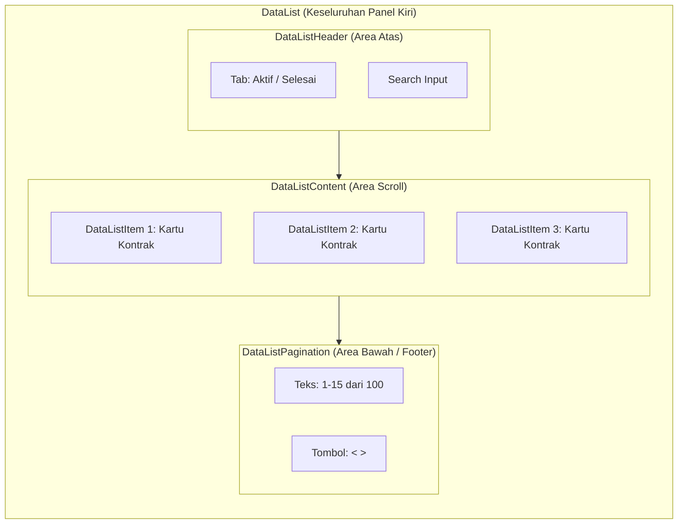

```mermaid
graph TD
    subgraph DataList ["DataList (Keseluruhan Panel Kiri)"]
        direction TB
        
        subgraph DataListHeader ["DataListHeader (Area Atas)"]
            direction TB
            T[Tab: Aktif / Selesai]
            S[Search Input]
        end
        
        subgraph DataListContent ["DataListContent (Area Scroll)"]
            direction TB
            I1[DataListItem 1: Kartu Kontrak]
            I2[DataListItem 2: Kartu Kontrak]
            I3[DataListItem 3: Kartu Kontrak]
        end
        
        subgraph DataListPagination ["DataListPagination (Area Bawah / Footer)"]
            direction LR
            P[Teks: 1-15 dari 100]
            Btn[Tombol: < >]
        end
        
        DataListHeader --> DataListContent
        DataListContent --> DataListPagination
    end
```
